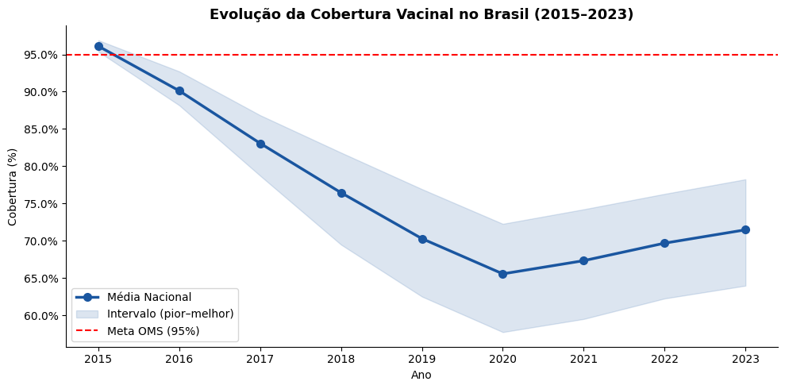
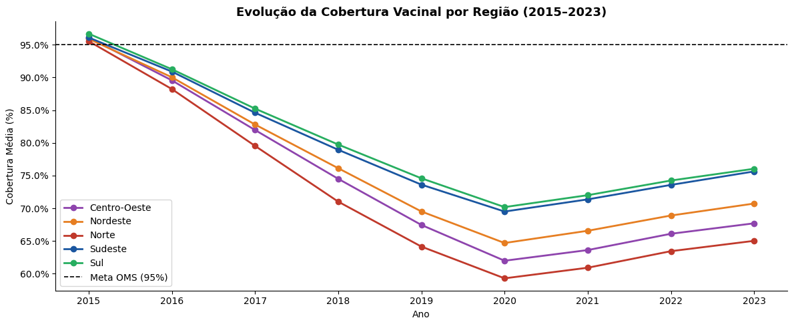
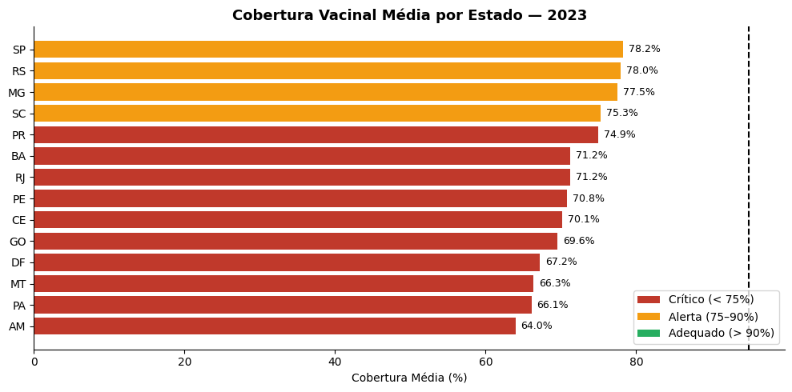
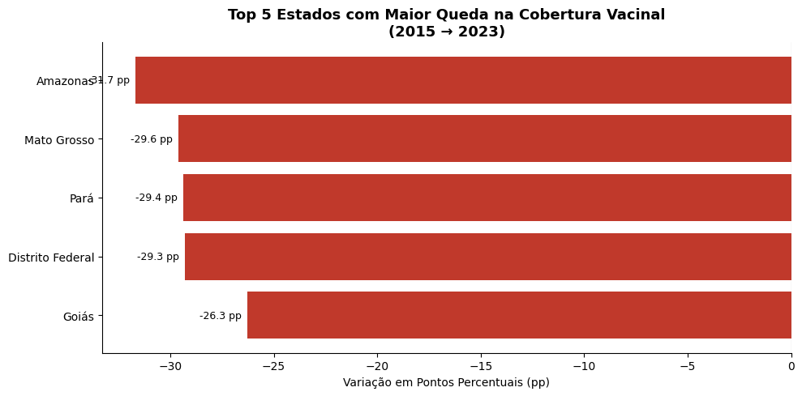
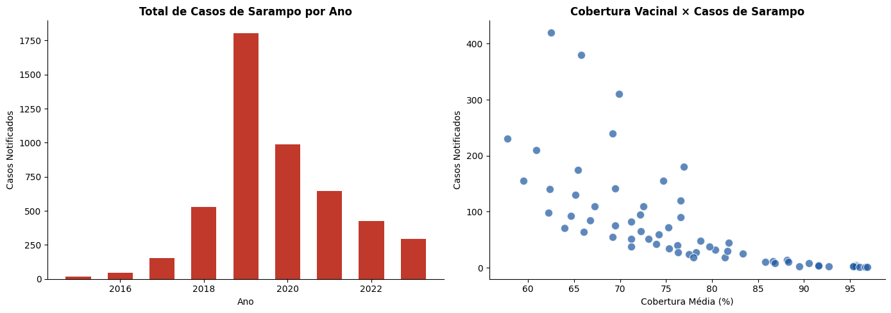

# 💉 Análise de Saúde Vacinal — Brasil (2015–2023)

> Projeto de análise de dados de saúde pública com dados reais do governo brasileiro — cobertura vacinal por estado, região, vacina e período usando MySQL, Python e Power BI. Os scripts Python geram gráficos analíticos automaticamente ao serem executados.


---

## 📸 Dashboard Power BI

> Dashboard interativo com filtros por região, estado, vacina e ano.

| Região Nordeste | Região Sudeste |
|---|---|
| (images/dashboard.pbix) |

---

## 🤖 Gráficos Gerados Automaticamente pelo Python

> Ao executar o script principal, todos os gráficos abaixo são gerados automaticamente.

### 📈 Evolução da Cobertura Vacinal no Brasil (2015–2023)

> O Brasil atingiu **96% de cobertura em 2015**, acima da meta OMS de 95%. A partir daí, a cobertura caiu consistentemente, atingindo o pior índice em **2020 com 65.5%** — reflexo da pandemia e da desinformação. Em 2023, a média nacional ainda é de apenas **71.5%**, muito abaixo da meta.

---

### 🗺️ Evolução por Região (2015–2023)

> Todas as regiões iniciaram 2015 acima de 95% e caíram abaixo da meta OMS. A região **Norte** teve a queda mais acentuada, chegando a **60% em 2020**. O **Sul** se recuperou melhor, chegando a **76% em 2023**, mas ainda longe da meta.

---

### 📊 Cobertura Vacinal por Estado — 2023

> Nenhum estado atingiu a meta OMS de 95% em 2023. **SP, RS e MG** lideram com ~78%, classificados como "Alerta". **AM (64%)** é o estado mais crítico. Todos os 14 estados analisados estão abaixo do mínimo recomendado.

---

### 📉 Top 5 Estados com Maior Queda (2015→2023)

> **Amazonas (-31.7pp)** lidera a queda, seguido de **Mato Grosso (-29.6pp)** e **Pará (-29.4pp)**. Todos os estados do ranking perderam mais de 26 pontos percentuais de cobertura em 8 anos.

---

### 🦠 Casos de Sarampo × Cobertura Vacinal

> O surto de sarampo em **2019 (1.800 casos)** coincide diretamente com a queda da cobertura vacinal. O gráfico de dispersão confirma a correlação negativa: **quanto menor a cobertura, maior o número de casos notificados**.

---

## 📌 Principais Insights

- 📉 Brasil caiu de **96% (2015)** para **71.5% (2023)** de cobertura — queda de 24.5 pontos percentuais
- 🚨 **Nenhum estado** atingiu a meta OMS de 95% em 2023
- 🌵 **Amazonas** teve a maior queda: **-31.7pp** entre 2015 e 2023
- 🦠 Surto de sarampo em 2019 (**1.800 casos**) correlaciona diretamente com queda da vacinação
- 📍 **Norte e Nordeste** são as regiões mais críticas em 2023
- ✅ **Sul** é a região com melhor recuperação pós-pandemia

---

## 🎯 Perguntas de Negócio Respondidas

- Quais **estados e regiões** têm maior e menor cobertura vacinal?
- Como evoluiu a **cobertura vacinal** entre 2015 e 2023?
- Qual o impacto da **queda de vacinação** nos casos de sarampo?
- Quais estados tiveram a **maior queda** de cobertura no período?
- O Brasil está atingindo a **meta OMS de 95%**?

---

## 🗂️ Estrutura do Repositório

```
saude-vacinal-brasil/
│
├── dados/
│   ├── dados_brutos.csv               # Base de dados original
│   └── dados_tratados.csv             # Base após tratamento
│
├── scripts/
│   ├── tratamento.py                  # Limpeza e tratamento dos dados
│   ├── analise_eda.py                 # EDA + geração automática de gráficos
│   └── consultas.sql                  # Queries SQL utilizadas
│
├── images/
│   ├── dashboard_nordeste.png         # Dashboard Power BI — Nordeste
│   ├── dashboard_sudeste.png          # Dashboard Power BI — Sudeste
│   ├── grafico_evolucao_nacional.png  # Evolução nacional 2015–2023
│   ├── grafico_evolucao_regiao.png    # Evolução por região
│   ├── grafico_cobertura_estados_2023.png  # Cobertura por estado em 2023
│   ├── grafico_queda_estados.png      # Top 5 estados com maior queda
│   └── grafico_sarampo_cobertura.png  # Casos de sarampo × cobertura
│
├── dashboard/
│   └── saude_vacinal.pbix             # Dashboard Power BI interativo
│
└── README.md
```

---

## 🗄️ Modelagem do Banco de Dados (MySQL)

```
estados              cobertura_vacinal
────────             ─────────────────
estado_id  ──►       estado_id
nome                 vacina_id ──►
regiao               ano
                     doses_aplicadas
                     cobertura_pct

vacinas              doencas_notificadas
────────             ───────────────────
vacina_id            estado_id
nome                 doenca
tipo                 ano
                     casos_notificados
```

---

## 🛠️ Tecnologias Utilizadas

| Ferramenta | Finalidade |
|---|---|
| Python 3 | Linguagem principal + automação de gráficos |
| MySQL | Banco de dados relacional |
| Pandas | Manipulação e tratamento de dados |
| Matplotlib / Seaborn | Geração automática de visualizações |
| Power BI | Dashboard interativo com mapas e filtros |
| Excel | Base de dados original |

---

## ▶️ Como Executar

**Pré-requisitos:**
- Python 3.8+
- MySQL rodando localmente
- Bibliotecas: `pandas`, `matplotlib`, `seaborn`, `pymysql`, `openpyxl`

**Instalação:**
```bash
pip install pandas matplotlib seaborn pymysql openpyxl
```

**Passos:**
1. Clone o repositório
```bash
git clone https://github.com/GabrielCruz079/saude-vacinal-brasil.git
```

2. Importe os dados para o MySQL e execute o `consultas.sql`

3. Ajuste as credenciais no script:
```python
conn = pymysql.connect(
    host='localhost',
    user='root',
    password='sua_senha',
    database='saude_vacinal'
)
```

4. Execute — os gráficos serão gerados automaticamente:
```bash
python scripts/analise_eda.py
```

5. Abra o `dashboard/saude_vacinal.pbix` no Power BI Desktop

---

## 👨‍💻 Autor

**Gabriel Ramos Cruz**
Cientista de Dados em Formação | Ciência da Computação — Cruzeiro do Sul

[](https://linkedin.com/in/gabriel-ramos-50a081357)
[](https://github.com/GabrielCruz079)
[](https://gabrielcruz079.github.io)
